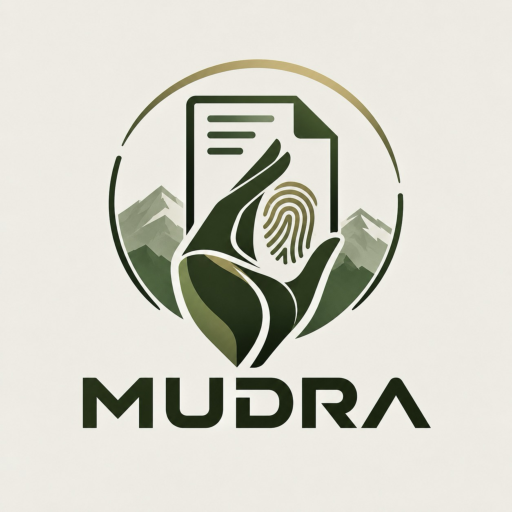

<p align="center"></p>

<h1 align="center">MUDRA</h1>
<p align="center"><b>M</b>ulti-recipient · <b>U</b>ndeniable · <b>D</b>ecryption · <b>R</b>ecord &amp; · <b>A</b>ttribution</p>
<p align="center"><i>Every copy knows its owner.</i></p>

**Smart India Hackathon 2026 · Problem 26237 · Team TECHG**
Cryptographic Attribution and Immutable Decryption Provenance for Multi-Recipient Encrypted Document Distribution.

MUDRA lets an office send one encrypted document to many officers. Each officer's copy quietly carries their identity, and every opening is signed. If the document leaks, as a file, a screenshot or copied text, MUDRA names the person whose copy it was.

---

## Why MUDRA

| Problem | MUDRA |
|---|---|
| A leaked document has no name on it | Every opened copy is marked, invisibly, with the identity of the person who opened it |
| Access logs can be quietly edited | Every opening is signed by the recipient and written to a hash-chained, signed ledger |
| One document, many readers | The file is encrypted once, with a separately sealed key for each recipient |
| Quantum computers will break RSA and ECC | NIST post-quantum algorithms (ML-KEM, ML-DSA) from day one |

## What makes it different

### A watermark that survives the leak
Each copy carries a unique ID in three independent hidden layers, so a leak is traceable however it gets out:

| Layer | Where it hides | Survives |
|---|---|---|
| Word spacing | Tiny shifts in the space between words | Re-saved and edited PDFs |
| Zero-width text | Invisible Unicode characters in the text | Copy-paste into chats and emails |
| Image watermark | Frequency-domain (DCT) marks with an FFT sync pattern | Screenshots, resizing, rotation, compression, cropping |

The image layer is protected by error-correcting codes and a checksum, so a badly damaged copy is reported as unreadable rather than blamed on the wrong person.

### A record nobody can rewrite
Before any content is released, the recipient's ML-DSA-65 key signs the access record (document, hash, session, watermark ID, time). Every distribution, opening, preview and download is appended to a hash-chained ledger signed by the node, so any edit or deletion is detected on verification.

### Built for real offices
- **Fully offline** desktop app; no cloud service needed.
- **Team mode** over a local network: one computer hosts, others join.
- **Screen-capture shielded** window, with a watermarked preview first and download as a separate, logged choice.
- **Independent roles:** anyone can send, anyone with keys can receive, and investigators trace leaks.

---

## How it works

```
 Keys ──► Encrypt once ──► Sign & open ──► Preview ──► Trace
```

1. **Keys:** each recipient gets an ML-KEM-768 key pair (receiving) and an ML-DSA-65 key pair (signing). Private keys are stored encrypted.
2. **Encrypt once:** the file is encrypted with AES-256-GCM; the document key is sealed separately for every recipient with ML-KEM and HKDF bound to the document and recipient.
3. **Sign & open:** the recipient signs the access record first; only then is their envelope opened and a copy marked for this opening produced.
4. **Preview:** the marked copy opens in a screen-capture shielded view. Downloading is optional and logged.
5. **Trace:** an investigator uploads a leaked file, screenshot or pasted text; each layer is read independently and matched to the signed record and the recipient.

## Tech stack

| Area | Technology |
|---|---|
| Post-quantum crypto | ML-KEM-768 (FIPS 203), ML-DSA-65 (FIPS 204) via `pqcrypto` |
| Symmetric crypto | AES-256-GCM, HKDF-SHA256, SHA-256 |
| Watermarking | NumPy, PyMuPDF |
| Backend | Python, FastAPI, SQLAlchemy, Alembic |
| Database | SQLite (offline) or PostgreSQL |
| Frontend | React, TypeScript, Vite |
| Desktop | Electron, PyInstaller; OS Keychain / DPAPI for app secrets |

---

## Getting started

### Desktop app
Build the installer on the operating system you want it for (details in [desktop/README.md](desktop/README.md)):

```bash
cd desktop
npm install
npm run dist        # macOS: dist/MUDRA-<version>-arm64.dmg · Windows: dist/MUDRA Setup <version>.exe
```

On first launch choose **This computer only**, **Host for my team** or **Join a host**.

### From source
Needs Python 3.11+ and Node.js 18+.

```bash
python3 -m venv .venv && source .venv/bin/activate
pip install -r requirements.txt
./run-offline.sh            # API on http://127.0.0.1:8000, local SQLite database
```

In a second terminal:

```bash
cd frontend && npm install && npm run dev     # http://localhost:5173
```

`run-offline.sh` reads `JWT_SECRET` and `KEYSTORE_MASTER_KEY` from a `.env` file in the project root (never commit it):

```bash
python -c "import secrets; print(secrets.token_urlsafe(48))"                    # JWT_SECRET
python -c "import base64,os; print(base64.b64encode(os.urandom(32)).decode())"  # KEYSTORE_MASTER_KEY
```

### Tests

```bash
PYTHONPATH=backend python -m pytest backend/tests
```

The watermark robustness method and results are in [docs/watermark-robustness-layer3.md](docs/watermark-robustness-layer3.md).

---

## Project structure

```
backend/
  app/api/routes/    auth, users, documents, decryption, forensics, provenance
  app/services/      crypto, watermark layers, provenance, ledger
  alembic/           database migrations
  tests/             crypto, broadcast, watermark and ledger tests
frontend/            React interface
desktop/             Electron app, launcher and installer build
docs/                watermark robustness report
```

## References

- NIST FIPS 203: [ML-KEM](https://nvlpubs.nist.gov/nistpubs/fips/nist.fips.203.pdf)
- NIST FIPS 204: [ML-DSA](https://nvlpubs.nist.gov/nistpubs/FIPS/NIST.FIPS.204.pdf)
- NIST FIPS 205: [SLH-DSA](https://nvlpubs.nist.gov/nistpubs/FIPS/NIST.FIPS.205.pdf)
- Balachandran, S. and Sivankalai, S. "A Post-Quantum Digital Preservation and Secure File Sharing Framework for Library Repositories." *Preservation, Digital Technology & Culture*, 2026. https://doi.org/10.1515/pdtc-2025-0090
- K. J. Brakas and M. Alanezi, "Watermarked PDF File Sharing and Security Blockchain-based System," *ICCR 2025*, Dubai. https://doi.org/10.1109/ICCR67387.2025.11292127
